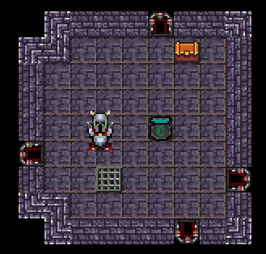
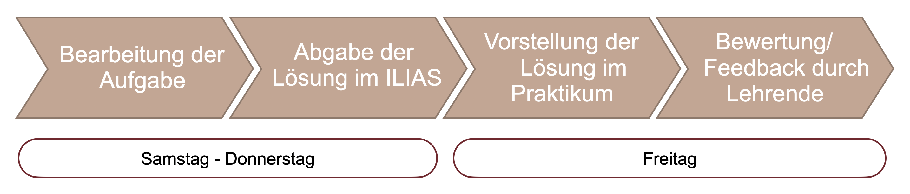
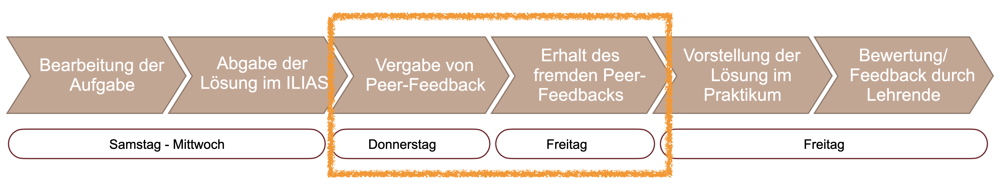
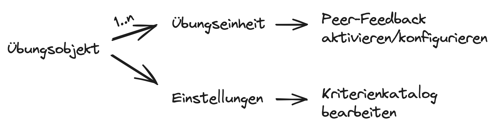
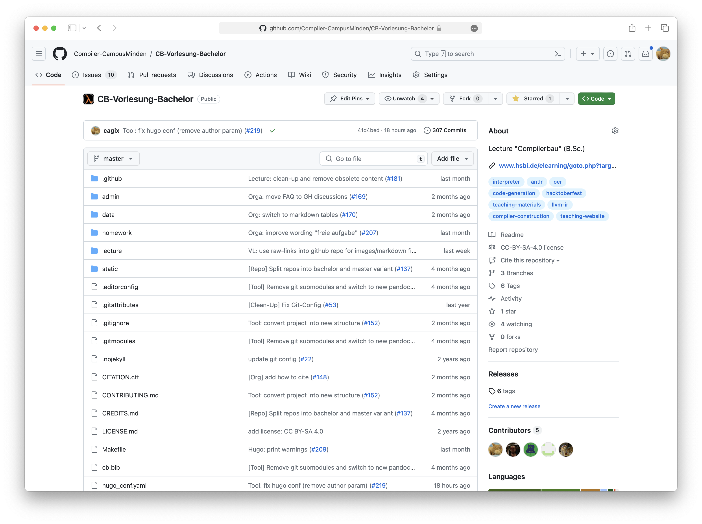
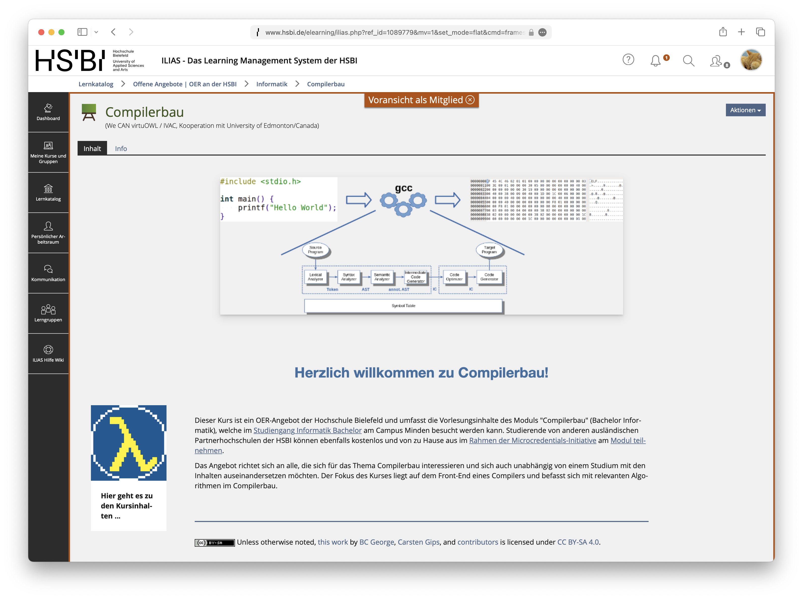
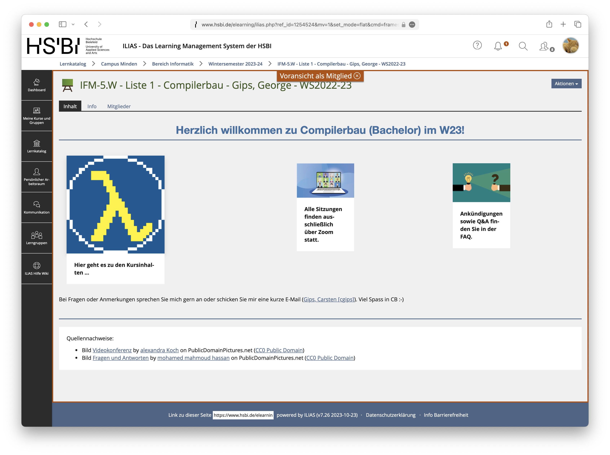
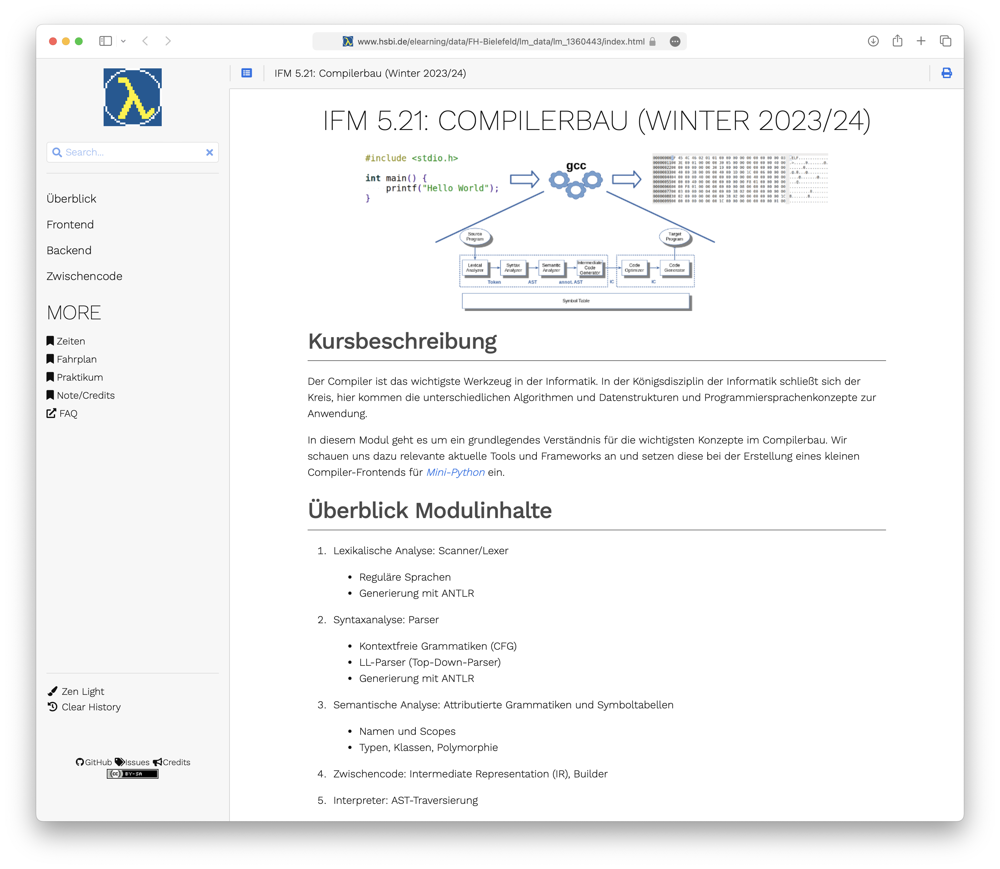
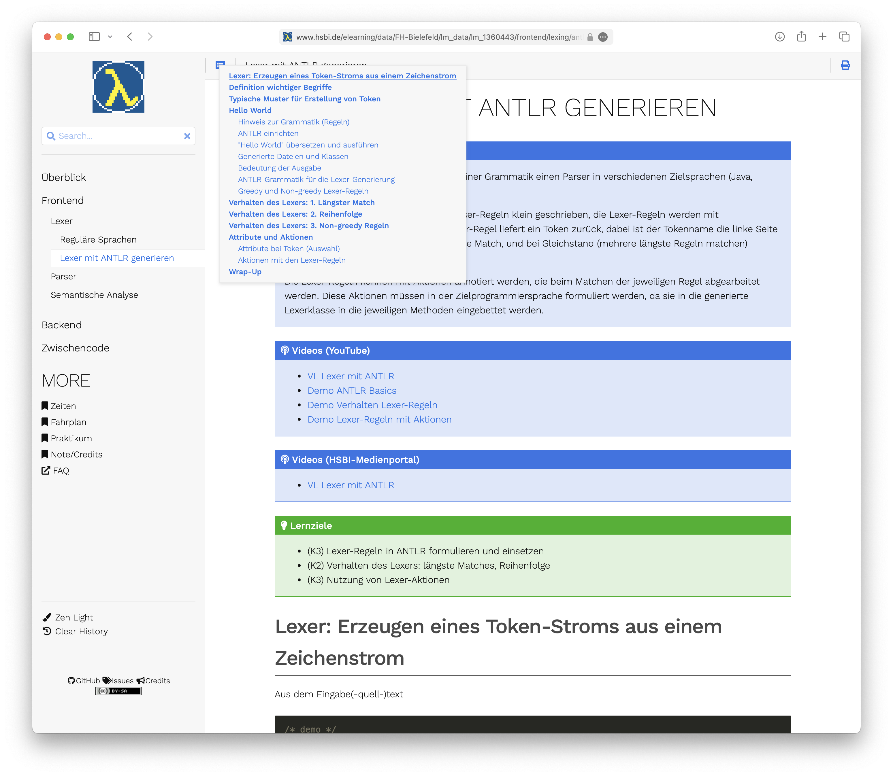

## Ausgangssituation: Lehrmaterialien als OER

## Unterstützung durch Digi-Scouts von DigikoS

Die Entwicklung und Umsetzung der Konzepte wurde unterstützt durch das [DigikoS](https://www.digikos.de/)-Projekt. Dazu gehörten:

-   Einrichtung des Kursraumes in ILIAS
-   Konfiguration des Peer-Feedbacks
-   Konfiguration der Objekte für die Zyklen
-   Umsetzung der Poster-Galerie
-   Hilfe bei der Entwicklung von Umfragen zur Evaluation der eingesetzten Techniken

## Lernszenario "Programmiermethoden": Wir entwickeln ein Spiel

::: notes
Das Modul "Programmiermethoden" im zweiten Semester Informatik am Campus Minden beschäftigt sich mit fortgeschrittenen Inhalten zum Thema Programmieren mit Java.

Wir setzen im Praktikum auf eine Variante der Gamification: Die Studierenden wenden die theoretischen Inhalte im Praktikum an und programmieren schrittweise über das Semester hinweg ein Spiel. Die Studierenden arbeiten dabei in kleinen Teams von drei Personen.

{width=40%}
:::

::: slides
{width=40%}

\pause
\bigskip
:::

::: notes
Hierzu gibt es wöchentliche Übungsaufgaben. Diese werden von den Studierenden teamweise in der Selbststudiumszeit bearbeitet. Die Abgabe erfolgt im ILIAS über ein Übungsobjekt. Im Praktikum stellen die Studierenden ihre Lösungen den Lehrenden vor und erhalten dabei Feedback von den Lehrenden.

{width=70%}
:::

::: slides
{width=70%}
:::

## Peer-Feedback zu Übungsaufgaben im ILIAS

Ziele Peer-Feedback: Studierende sollen ...

-   Fremde Lösungen (Code) lesen lernen
-   Fremde Konzepte bewerten lernen
-   Anregungen für ihre eigenen Lösungen bekommen (Spieleentwicklung!)

::: notes

:::

::: slides
\bigskip
\bigskip

:::

::: notes
Im Übungsobjekt im ILIAS kann das Peer-Feedback aktiviert werden. Dort können dann Fragenkataloge hinterlegt werden, die beim Feedback bearbeitet werden müssen.

Organisatorisch findet die Peer-Feedback-Phase nach der Abgabe im ILIAS und vor der Vorstellung im Praktikum statt. Nach Ablauf der Abgabefrist wird vom ILIAS jeder Person mit einer Abgabe automatisch eine konfigurierbare Anzahl anderer Lösungen zum Review zugewiesen, wir haben hier mit zwei bis drei Reviews gearbeitet. Für das Review selbst muss entsprechend weitere Zeit eingeplant werden, im konkreten Fall wurde die Abgabe von Freitag vor dem Praktikum auf Donnerstag vorgezogen und die Peer-Feedback-Phase von Donnerstag bis Freitag vor dem Praktikum aktiviert. Anschließend wurde wie immer das Praktikum am Freitag durchgeführt, wobei hier zusätzlich das gegebene und empfangene Feedback mit diskutiert wurde.

Leider ist das Peer-Feedback in der ILIAS-Übung technisch nur für Einzelabgaben aktivierbar, so dass jede Person eines Teams einzeln abgeben muss.
:::

## Peer-Feedback: Kriterienkataloge im Übungsobjekt

::: notes
Im Übungsobjekt im ILIAS lassen sich Kriterienkataloge für das Peer-Feedback einrichten. Diese vorgegebenen Fragen müssen von den Teilnehmenden im Review beantwortet werden.

{width="80%"}

Es stehen u.a. "ja/nein"-Fragen, Checkboxen, 5-Sterne-Bewertung sowie Freitextfragen zur Verfügung. Ein Kriterienkatalog gilt für alle Übungen im Übungsobjekt.
:::

::: slides
{width="80%"}

\bigskip
:::

Beispiele für [verwendete]{.notes} Review-Fragen:

-   Wie gut können Sie die Modellierung nachvollziehen? ([5-Sterne-Bewertung]{.alert})
-   Was gefällt Ihnen an der Modellierung besonders? ([Text]{.alert})
-   Wie könnte die Modellierung verbessert werden? ([Text]{.alert})
-   Beurteilen Sie die Dokumentation des Codes und geben Sie Verbesserungshinweise. ([Text]{.alert})
-   Kein Review – es handelt sich um die Abgabe meines Teams. ([Erfüllt Ja/Nein]{.alert})

## Peer-Feedback: Lessons Learned

::: notes
Das Peer-Feedback war recht erfolgreich und wurde von den meisten Studierenden gut angenommen.

{width="40%"}

Insbesondere lässt sich positiv vermerken, dass die gesteckten Ziele wie (a) fremde Lösungen (Code) lesen lernen, (b) fremde Konzepte bewerten lernen, und (c) Anregungen für die eigenen Lösungen bekommen über das Peer-Feedback erreicht wurden. Durch die Beschäftigung mit fremden Lösungen können sich die Studierenden auch besser im Klassenkontext einordnen.

{width="40%"}
:::

-   Fragen: Lieber Freitext statt Checkboxen bzw. 5-Sterne-Bewertung nutzen

\smallskip

-   ILIAS:
    -   Peer-Feedback lässt sich nur für Einzelabgaben konfigurieren
    -   Kriterienkataloge lassen sich nicht kopieren

\smallskip

-   Organisation:
    -   Peer-Review == zusätzliche "Abgabe" (aus Studierendenperspektive)
    -   Zusätzliche Bearbeitungszeit notwendig

## Poster-Galerie im Modul "Künstliche Intelligenz"

## LICENSE

Unless otherwise noted, this work is licensed under CC BY-SA 4.0.

---

# Teil 1: Peer-Feedback für die Selbstlernphase

## Lernszenario: Wir entwickeln ein Spiel

-   Lehrveranstaltung zum Thema Programmieren mit Java (Aufbau-Modul)
-   Gamification: Studierende entwickeln in kleinen Teams über das Semester hinweg ein Spiel
-   Setting:
    -   Bearbeitung der Aufgaben `@home`
    -   Vorstellung durch Studierende im Praktikum (den Lehrenden gegenüber)
    -   Feedback und Bewertung der Bearbeitung durch Lehrende

**TODO**: Skizze mit Woche und Bearbeitung und Abgabe/Feedback

## Peer-Feedback

-   Ziele:
    -   Studierende sollen fremde Lösungen (Code) lesen lernen
    -   Studierende sollen fremde Konzepte bewerten lernen
    -   Studierenden sollen Anregungen für ihre eigenen Lösungen bekommen (Spieleentwicklung!)

-   Organisatorisch: Abgabe zwei Tage früher, Peer-Feedback im ILIAS, danach Praktikum
-   Technisch: ILIAS, Peer-Feedback für Übungen aktiviert

**TODO**: Skizze mit Woche und Bearbeitung und Abgabe und Peer-Feedback und Lehrenden-Feedback

## Kriterien

**TODO**: Screenshots der Fragenkataloge (Konzeptphase, Umsetzungsphase)

## Lessons Learned

:::::: columns
::: column

-   Studierende können fremde Lösungen (Code) (besser) lesen
-   Studierende können fremde Konzepte bewerten
-   Studierende bekommen vielfältige Anregungen für eigene Arbeit
-   Studierende können sich besser im Klassenkontext einordnen

:::
::: column

-   Einrichtung ILIAS relativ aufwändig: Kriterienkataloge sollten zu Beginn feststehen
-   Arbeit in Gruppen, Peer-Feedback im ILIAS funktioniert aber nur für Einzelabgaben
-   Kontrolle der abgegebenen Feedbacks relativ aufwändig (UX im ILIAS)
-   Orga: für das Peer-Feedback muss Zeit eingeplant werden, welche im wöchentlichen Rhythmus dann schmerzhaft fehlt

:::
::::::

# Teil 2: Einrichtung Kursräume

## Szenario: Konzept- und Umsetzungsphase
<!-- TODO: ausblenden? -->

-   Zyklus: Abwechselnd eine Woche Erstellung eines Konzepts und anschließend eine Woche Umsetzung des Konzepts
-   Unterschiedliche Feedback-Kataloge
-   Studierende sollten geführt werden, damit sie sich (a) im aktuellen Zyklus und (b) der aktuellen Phase im Zyklus wiederfinden

## Einrichtung des ILIAS-Kursraums
<!-- TODO: ausblenden? -->

-   Seitengestaltung:
    -   Für jeden Zyklus einen Block angelegt mit entsprechenden Inhalten und Links auf Objekte
    -   Blöcke zeitgesteuert aktiviert und deaktiviert
    -   Blöcke zusätzlich farblich unterschiedlich

Studierende sehen dadurch nur die Kerninformationen sowie den Block für den aktuellen Zyklus

## So sieht es aus

**TODO**: Screenshot Studi-Sicht

**TODO**: Screenshot Admin-Sicht

## Poster-Galerie

**TODO**: Screenshot Studi-Sicht

## Digi-Scouts von DigikoS

**TODO**: Unterstützung durch Digi-Scouts vom DigikoS-Projekt

# Teil 3: OER-Kurse

## Konzept

-   Prof. Gips hat aktuell vier Module als OER überarbeitet und bereitgestellt
    -   Entwicklung und Versionierung der Inhalte auf GitHub als Markdown-Quellen
    -   Selbstentwickelte Toolchain erstellt daraus automatisch Folien (PDF) sowie interaktive Lehrunterlagen (HTML-Lernmodul)
-   Kurse werden im offenen Bereich im ILIAS angelegt: Beschreibung, Lernmodul, Link zum aktuellen geschlossenen Kursraum
-   Geschlossener Kursraum für Durchführung des Moduls: Organisation der Studierenden, Abgaben im Praktikum, ... => Link in den offenen Kursraum für das Lernmodul

## So sieht es aus: Screenshot GitHub Compilerbau

## So sieht es aus: Screenshot offener Kursraum Compilerbau

## So sieht es aus: Screenshot geschlossener Kursraum Compilerbau

Quelle: [Videokonferenz](https://www.publicdomainpictures.net/de/view-image.php?image=387148&picture=videokonferenz) by [alexandra Koch](https://www.publicdomainpictures.net/de/browse-author.php?a=155932) on PublicDomainPictures.net ([CC0 Public Domain](http://creativecommons.org/publicdomain/zero/1.0/))

Quelle: [Fragen und Antworten](https://www.publicdomainpictures.net/de/view-image.php?image=387458&picture=fragen-und-antworten) by [mohamed mahmoud hassan](https://www.publicdomainpictures.net/de/browse-author.php?a=138450) on PublicDomainPictures.net ([CC0 Public Domain](http://creativecommons.org/publicdomain/zero/1.0/))

## So sieht es aus: Screenshot Lernmodul Compilerbau

:::::: columns
::: column

:::
::: column

:::
::::::

# Backlog

## OER-Kurse

-   Künstliche Intelligenz: [ILIAS](https://www.hsbi.de/elearning/goto.php?target=crs_1089753&client_id=FH-Bielefeld), [GitHub](https://github.com/Artificial-Intelligence-HSBI-TDU/KI-Vorlesung)
-   Programmiermethoden: [ILIAS](https://www.hsbi.de/elearning/goto.php?target=crs_1089782&client_id=FH-Bielefeld), [GitHub](https://github.com/Programmiermethoden/PM-Lecture)
-   Compilerbau: [ILIAS](https://www.hsbi.de/elearning/goto.php?target=crs_1089779&client_id=FH-Bielefeld), [GitHub](https://github.com/Compiler-CampusMinden/CB-Vorlesung-Bachelor)
-   Concepts of Programming Languages: [ILIAS](https://www.hsbi.de/elearning/goto.php?target=crs_1302203&client_id=FH-Bielefeld), [GitHub](https://github.com/Compiler-CampusMinden/CB-Vorlesung-Master)

# LICENSE

## LICENSE

{width="20%"}

Unless otherwise noted, this work is licensed under CC BY-SA 4.0.
