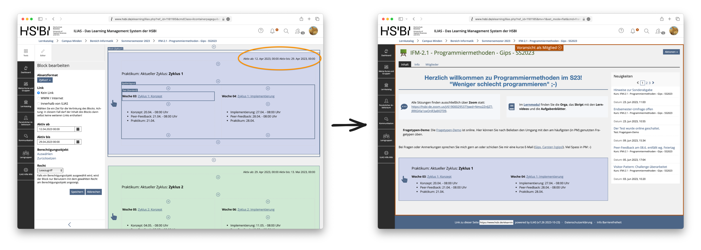
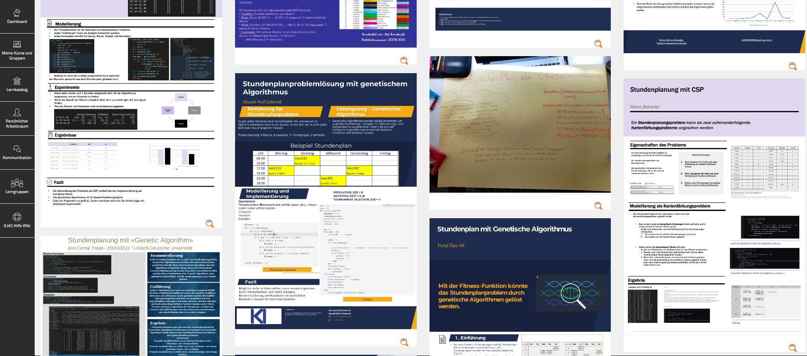
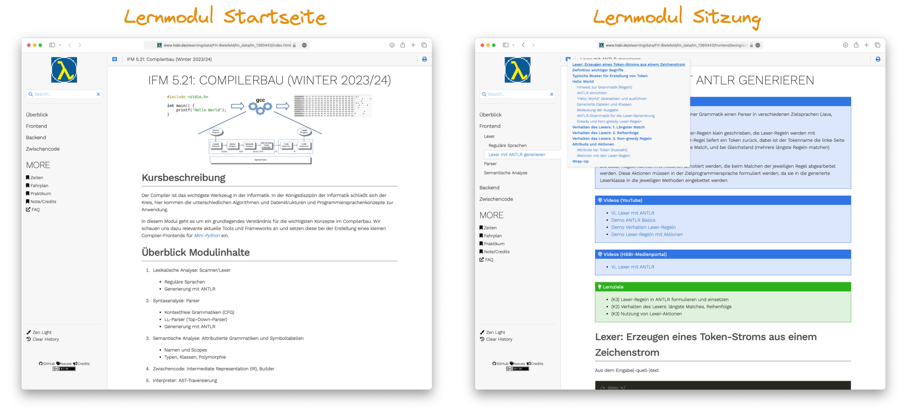

## Lernszenario "Programmiermethoden": Wir entwickeln ein Spiel

::: notes
Gemeinsam mit dem DigikoS-Team haben wir in den letzten Semestern verschiedene unterstützende Elemente digitaler Lehre erarbeitet und erprobt. Exemplarisch sollen hier die Erfahrungen im Modul "Programmiermethoden" aus dem Sommersemester 2023 dargestellt werden.

Das Modul "Programmiermethoden" im zweiten Semester Informatik am Campus Minden beschäftigt sich mit fortgeschrittenen Inhalten zum Thema Programmieren mit Java.

Wir setzen im Praktikum auf eine Variante der Gamification: Die Studierenden wenden die theoretischen Inhalte aus der Vorlesung aktiv im Praktikum an und programmieren schrittweise über das Semester hinweg ein Spiel. Die Studierenden arbeiten dabei in kleinen Teams von drei Personen.

{width=40%}
:::

::: slides
{width=40%}

\pause
\bigskip
:::

::: notes
Hierzu gibt es wöchentliche Übungsaufgaben. Diese werden von den Studierenden teamweise in der Selbststudiumszeit bearbeitet. Die Abgabe erfolgt im ILIAS über ein Übungsobjekt. Im Praktikum stellen die Studierenden ihre Lösungen den Lehrenden vor und erhalten dabei Feedback von den Lehrenden.

{width=70%}
:::

::: slides
{width=70%}
:::

## Peer-Feedback zu Übungsaufgaben im ILIAS

**Ziele Peer-Feedback**: Studierende sollen ...

-   Fremde Lösungen (Code) lesen lernen
-   Fremde Konzepte bewerten lernen
-   Anregungen für ihre eigenen Lösungen bekommen (Spieleentwicklung!)

::: notes

:::

::: slides
\bigskip
\bigskip
\smallskip

:::

::: notes
Organisatorisch findet die Peer-Feedback-Phase nach der Abgabe im ILIAS und vor der Vorstellung im Praktikum statt.

Nach Ablauf der Abgabefrist wird vom ILIAS jeder Person mit einer Abgabe automatisch eine konfigurierbare Anzahl anderer Lösungen zum Review zugewiesen, wir haben hier mit zwei bis drei Reviews gearbeitet. Für das Review selbst muss entsprechend weitere Zeit eingeplant werden, im konkreten Fall wurde die Abgabe von Freitag vor dem Praktikum auf Donnerstag vorgezogen und die Peer-Feedback-Phase von Donnerstag bis Freitag vor dem Praktikum aktiviert.

Anschließend wurde wie immer das Praktikum am Freitag durchgeführt, wobei hier zusätzlich das gegebene und empfangene Feedback mit diskutiert wurde.

Leider ist das Peer-Feedback in der ILIAS-Übung technisch nur für Einzelabgaben aktivierbar, so dass jede Person eines Teams einzeln abgeben muss.
:::

## Peer-Feedback: Kriterienkataloge im Übungsobjekt

::: notes
Im Übungsobjekt im ILIAS lassen sich Kriterienkataloge für das Peer-Feedback einrichten (vgl. Abb. \ref{fig:einrichten:kriterienkatalog}). Diese vorgegebenen Fragen müssen von den Teilnehmenden im Review beantwortet werden.

{width="80%"}

Es stehen u.a. "ja/nein"-Fragen, 5-Sterne-Bewertung sowie Freitextfragen zur Verfügung (vgl. Abb. \ref{fig:kriterien:kriterienkatalog}). Ein Kriterienkatalog gilt für alle Übungseinheiten im Übungsobjekt.

{width="40%"}

In den einzelnen Übungseinheiten in einem Übungsobjekt im ILIAS kann/muss das Peer-Feedback je Übungseinheit individuell aktiviert (vgl. Abb. \ref{fig:aktivieren:peerfeedback}) und konfiguriert (vgl. Abb. \ref{fig:konfigurieren:peerfeedback}) werden.

{width="80%"}

{width="80%"}
:::

::: slides
{width="80%"}

\bigskip
:::

**Beispiele für [verwendete]{.notes} Review-Fragen**:

-   Wie gut können Sie die Modellierung nachvollziehen? ([5-Sterne-Bewertung]{.alert})
-   Was gefällt Ihnen an der Modellierung besonders? ([Text]{.alert})
-   Wie könnte die Modellierung verbessert werden? ([Text]{.alert})
-   Beurteilen Sie die Dokumentation des Codes und geben Sie Verbesserungshinweise. ([Text]{.alert})
-   Kein Review – es handelt sich um die Abgabe meines Teams. ([Erfüllt Ja/Nein]{.alert})

## Peer-Feedback: Lessons Learned

::: notes
Das Peer-Feedback war recht erfolgreich und wurde von den meisten Studierenden gut angenommen.

### Was war gut
Insbesondere lässt sich positiv vermerken, dass die gesteckten Ziele wie (a) fremde Lösungen (Code) lesen lernen, (b) fremde Konzepte bewerten lernen, und (c) Anregungen für die eigenen Lösungen bekommen über das Peer-Feedback erreicht wurden. Durch die Beschäftigung mit fremden Lösungen können sich die Studierenden auch besser im Klassenkontext einordnen.

### Was könnte beim nächsten Mal besser sein
:::

-   **Fragen**: Lieber Freitext statt Checkboxen bzw. 5-Sterne-Bewertung nutzen
    [(Freitext erzwingt eine aktivere Auseinandersetzung)]{.notes}

\smallskip

-   **ILIAS**:
    -   Peer-Feedback lässt sich nur für Einzelabgaben konfigurieren
        [(problematisch bei Bearbeitung in kleinen Teams)]{.notes}
    -   Keine Nachfrist oder individuelle Abgabe möglich
    -   Kriterienkataloge lassen sich nicht kopieren
        [(sollten zu Beginn der Veranstaltung feststehen)]{.notes}

\smallskip

-   **Organisation**:
    -   Zusätzliche Bearbeitungszeit für Peer-Feedback notwendig
    -   Peer-Review == zusätzliche "Abgabe" (aus Studierenden-Perspektive)
    -   Höherer Workload für die Studierenden

## Mehrwöchige Arbeitszyklen: Orientierung im ILIAS

::: notes
Die Arbeit der Studierenden wurde auf mehrere zweiwöchige Zyklen aufgeteilt (Abb. \ref{fig:abgabe:zyklus}).

Dabei wurde jeweils in der ersten Woche eines Zyklus ein Konzept für bestimmte Spielsituationen erstellt und bewertet (Peer-Feedback plus Dozentenfeedback), und in der zweiten Woche erfolgte die Umsetzung inkl. Feedback (erneut Peer-Feedback plus Dozentenfeedback). In jeder Zyklus-Phase wurden unterschiedliche, angepasste Feedback-Kriterienkataloge genutzt. Insgesamt folgten fünf solcher Zyklen aufeinander.
:::

::: slides
{width="80%"}
:::

::: notes
Um den Studierenden eine bessere Orientierung zu geben, (a) in welchem Zyklus und (b) in welcher Woche des Zyklus sie sich befinden, wurde im ILIAS-Kursraum die Seite mit der Seitengestaltung in mehrere Blöcke unterteilt: Für jeden Zyklus wurde ein Block mit den nötigen Informationen und Verlinkungen auf andere ILIAS-Objekte (Übungsobjekt, ...) eingerichtet. Zur leichteren Wiedererkennung wurden diese Blöcke unterschiedlich eingefärbt (vgl. Abb. \ref{fig:zyklus:user}).

{width="80%"}

Alle **Blöcke wurden zeitgesteuert aktiviert und deaktiviert**, so dass für die Studierenden immer nur die relevanten Informationen für den aktuellen Zyklus sichtbar waren und keine extra Eingriffe seitens des Dozenten notwendig wurden (die Einstellungen lassen sich als Kurs-Admin über "Seite gestalten" erreichen: Abb. \ref{fig:zyklus:admin}).

{width="80%"}
:::

::: slides
\bigskip
\smallskip

{width="100%"}
:::

## Poster-Galerie im Modul "Künstliche Intelligenz"

::: notes
Im Modul "Künstliche Intelligenz" hatten die Studierenden die Aufgabe, ein Poster zu einem bestimmten Thema zu gestalten und ihre Arbeitsergebnisse dort geeignet zu visualisieren.

Wir haben im ILIAS-Kursraum eine Poster-Galerie eingerichtet. Dazu haben wir ein neues Objekt "Inhaltsseite" in den Kurs eingefügt und darin über "Seite gestalten" ein mehrspaltiges "Spaltenlayout" mit vier gleich breiten Spalten eingefügt. Die Poster der Studierenden lagen im PDF-Format vor und wurden für die Einbindung im ILIAS zunächst in das PNG-Format exportiert. Diese Bilder wurden dann in den Spalten als "Bild/Audio/Video"-Objekt eingefügt. In den Einstellung der dadurch entstehenden Medienobjekte muss jeweils einzeln noch "Vollbild anzeigen" aktiviert werden, damit ILIAS eine kleine Lupe für die Vergrößerung zum Vollbild anzeigt (vgl. Abb. \ref{fig:einrichten:medienobjekt}).

{width="25%"}

Dadurch entsteht in der Studierendenansicht des Kursraums eine mehrspaltige Poster-Galerie (vgl. Abb. \ref{fig:postergalerie}), in der jedes Poster als kleine Vorschau angezeigt wird und wo man jedes Poster per Klick auf das jeweilige Lupensymbol in der Vollbild-Ansicht in Ruhe betrachten kann.

{width="80%"}
:::

::: slides
{width="60%"}

\bigskip

{width="100%"}
:::

## Unterstützung durch Digi-Scouts von DigikoS

::: notes
Die Entwicklung und Umsetzung der Konzepte wurde unterstützt durch das [DigikoS](https://www.digikos.de/)-Projekt. Dazu gehörten:

-   Einrichtung des Kursraumes in ILIAS
-   Konfiguration des Peer-Feedbacks
-   Konfiguration der Objekte für die Zyklen
-   Umsetzung der Poster-Galerie
-   Hilfe bei der Entwicklung von Umfragen zur Evaluation der eingesetzten Techniken
:::

:::::: slides
\LARGE

::: center
[Vielen Dank an die Digi-Scouts vom [DigikoS](https://www.digikos.de/)-Projekt für die Unterstützung bei der technischen Umsetzung im ILIAS!]{.alert}
:::
::::::

## OER-Kurse

::: notes
### Konzept
Prof. Gips hat aktuell **vier Module als OER** überarbeitet und unter der CC BY-SA-4.0 Lizenz bereitgestellt.

Die **Entwicklung und Versionierung der Inhalte** (als Markdown-Quellen) erfolgt quelloffen auf **GitHub**. Über eine **selbstentwickelte Toolchain** werden daraus automatisch **Foliensätze (PDF) sowie interaktive Lehrunterlagen (HTML-Lernmodul) exportiert**.

Die generierten **Lernmodule werden in einen offenen Kursraum** integriert.

Für die **Durchführung der Module wird zusätzlich ein geschlossener Kursraum** angelegt. Hier werden personenbezogenen Daten und Vorgänge wie die Organisation der Studierenden und die Abgaben im Praktikum datenschutzkonform durchgeführt, für die Lehr-/Lern-Materialien gibt es einen Link auf das Lernmodul im offenen Kursraum.

Dieses Vorgehen ist über mehrere Jahre erfolgreich im Einsatz, es erlaubt eine schnelle Reaktion auf neue Themen oder das Korrigieren von Fehlern. Zusätzlich wird die zeitaufwändige manuelle Einrichtung der ILIAS-Kursräume auf ein Minimum reduziert.
:::

::: slides

:::

::: notes
### Beispiel Lernmodul Compilerbau
:::
::: slides
## Beispiel Lernmodul Compilerbau
:::

::: notes

Die Studierenden erreichen im Lernmodul zunächst eine Startseite mit einer kurzen fachlichen Einordnung sowie einem Überblick über die behandelten Inhalte und einer Darstellung des Prüfungsformats. Danach gibt es eine Übersicht über die einzelnen Wochen und die jeweils behandelten Themen sowie Aufgaben.

In den einzelnen Sitzungen ist der Aufbau über ein Template gesteuert. Hier finden die Studierenden zu einer Lern-Einheit eine Zusammenfassung, selbst erstellte Lehrvideos und Tutorials sowie Lernziele. Danach folgt die Darstellung des Lehrmaterials, gefolgt von Links zu Selbsttests (im ILIAS) sowie Challenges und Literatur zur Vertiefung. Die Studierenden können bequem per Navigation auf einen Abschnitt springen oder auch zu einem verwandeten Thema. Es gibt interaktive Elemente, zusätzlich sollen in Zukunft die Selbsttest aus dem ILIAS in das Lernmodul hineinverlagert werden, um den Studierenden eine Lernerfahrung ohne Medienbrüche zu ermöglichen.
:::
::: slides

:::

::: notes
### Aktuell verfügbare OER-Kurse

Aktuell sind vier verschiedene Module als OER-Kurse verfügbar (sowohl in Form der Quellen auf GitHub und auch als funktionsfähiges Lernmodul im offenen Bereich im ILIAS):

-   Künstliche Intelligenz: [ILIAS](https://www.hsbi.de/elearning/goto.php?target=crs_1089753&client_id=FH-Bielefeld), [GitHub](https://github.com/Artificial-Intelligence-HSBI-TDU/KI-Vorlesung)
-   Programmiermethoden: [ILIAS](https://www.hsbi.de/elearning/goto.php?target=crs_1089782&client_id=FH-Bielefeld), [GitHub](https://github.com/Programmiermethoden/PM-Lecture)
-   Compilerbau: [ILIAS](https://www.hsbi.de/elearning/goto.php?target=crs_1089779&client_id=FH-Bielefeld), [GitHub](https://github.com/Compiler-CampusMinden/CB-Vorlesung-Bachelor)
-   Concepts of Programming Languages: [ILIAS](https://www.hsbi.de/elearning/goto.php?target=crs_1302203&client_id=FH-Bielefeld), [GitHub](https://github.com/Compiler-CampusMinden/CB-Vorlesung-Master)

Diese Module werden schrittweise weiter ausgebaut und gepflegt. Weitere Module sind aktuell in Überarbeitung.
:::

## LICENSE

Unless otherwise noted, this work is licensed under CC BY-SA 4.0.

\bigskip

See [github.com/cagix/dlk23](https://github.com/cagix/dlk23) for sources, slides and handout.
